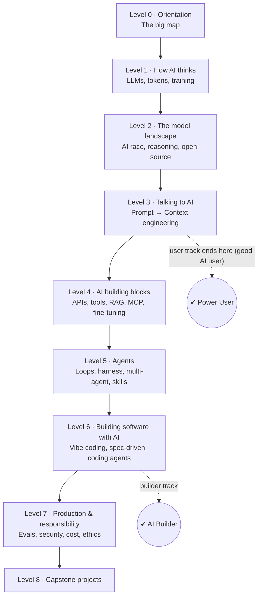
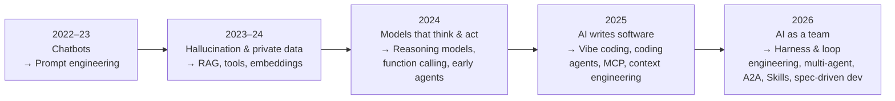

# Modern AI Era — Interactive Learning Hub (Plan)

## 1. What I understood from your request

| You said | What it means for the design |
|---|---|
| "I missed everything since ChatGPT (Nov 30, 2022)" | Start from zero, assume no prior AI knowledge |
| "Not a history documentation" | The **unit of learning is a skill/concept**, not an event. History appears only as a short *"Why was this invented?"* box in each module |
| "Every skill needed to extract the best value from AI" | Cover the whole stack: using AI → talking to AI → building with AI → agents → shipping safely |
| "Beginner → advanced, not too technical at start" | 8 levels with rising difficulty. Every module has a plain-language core plus an optional *"Go deeper"* section |
| Some technical background, not a regular coder | Code shows up from Level 4, always explained line by line. No-code paths are offered where they exist |
| Goals: build software with AI (vibe coding, agents) **and** build AI products (RAG, agents, APIs, fine-tuning) | Levels 4–6 are the heaviest. They end in hands-on capstone projects |
| Visual + conceptual learner | **Every module is built around a diagram** (custom SVG and interactive widgets). Every concept gets an analogy and a mental model, and the "why" comes before the "how" |
| Interactive local website, English | Offline HTML site with progress tracking, quizzes, a searchable glossary and a concept map |

---

## 2. User Review Required

> [!IMPORTANT]
> **Content accuracy and freshness.** My built-in knowledge stops before Oct 2026. For newer topics (2025–2026 tools, models, standards) I will check each module against current web sources while writing it. Each module will show an *"Accurate as of Oct 2026"* stamp. Tool and model names change fast. The **concepts** are the lasting part, and the course focuses on them.

> [!WARNING]
> **Scope is large: about 48 modules, 4 capstones, 150+ glossary terms.** That is roughly 40–60 hours of learning for you. I plan to build it in **3 phases** so you can start studying Phase 1 while I write the rest (see §6).

---

## 3. Open Questions

> [!IMPORTANT]
> 1. **Phased or all-at-once delivery?** My recommendation is phased: Phase 1 (site + Levels 0–3) first.
> 2. **Hands-on tools:** exercises will use free tiers (Google AI Studio / Gemini, ChatGPT free, Claude free, Ollama for local models). Do you have a preferred AI tool or paid subscription I should centre the exercises on?
> 3. **Hardware for local models:** do you have a GPU, and how much RAM? This only affects the "run a model locally" exercise.

---

## 4. The Curriculum (the core of this plan)

### 4.1 Learning path at a glance



### 4.2 How concepts evolved (shown as *"why each skill was born"*, not as history)



### 4.3 Full module list

Each module is tagged 🟢 Beginner, 🟡 Intermediate or 🔴 Advanced.

#### Level 0 — Orientation
| # | Module | Signature visual |
|---|---|---|
| 0.1 | 🟢 The Big Map: what changed 2022 → 2026 and why it matters to you | Interactive "eras → skills" map |
| 0.2 | 🟢 How to use this hub (tracks, levels, how to practise) | Track selector |

#### Level 1 — How Modern AI Thinks (pure concepts, no code)
| # | Module | Signature visual |
|---|---|---|
| 1.1 | 🟢 AI vs ML vs Deep Learning vs Generative AI | Nested circles |
| 1.2 | 🟢 What an LLM really is: a next-word predictor | **Interactive** next-token probability bars |
| 1.3 | 🟢 Tokens & the context window ("the model's working desk") | **Interactive** tokenizer demo |
| 1.4 | 🟢 How a model is made: pre-training → fine-tuning → RLHF | Factory pipeline diagram |
| 1.5 | 🟢 Temperature, randomness & why answers differ each time | **Interactive** temperature slider |
| 1.6 | 🟢 Hallucinations, knowledge cutoff & limits | "Confident guesser" diagram |
| 1.7 | 🟡 Transformers & attention, explained by intuition | Attention-lines visual |
| 1.8 | 🟡 Embeddings: meaning as coordinates | **Interactive** 2-D word-space plot |

#### Level 2 — The Model Landscape & the AI Race
| # | Module | Signature visual |
|---|---|---|
| 2.1 | 🟢 The AI race: labs, model families, what each is good at | Landscape map |
| 2.2 | 🟢 Multimodal AI: vision, voice, image, video, real-time | Input/output matrix |
| 2.3 | 🟡 Reasoning models & "thinking" (test-time compute) | Fast vs slow thinking diagram |
| 2.4 | 🟡 Open-source vs open-weight vs closed, plus running models locally | Spectrum + hardware-tier chart |
| 2.5 | 🟡 Choosing a model: benchmarks, cost, speed, context | Decision tree |
| 2.6 | 🔴 Under the hood of efficiency: MoE, distillation, quantization, small models | Expert-routing diagram |

#### Level 3 — Talking to AI: Prompt Engineering → Context Engineering
| # | Module | Signature visual |
|---|---|---|
| 3.1 | 🟢 Anatomy of a great prompt (role, task, context, format, constraints) | Labelled prompt "X-ray" |
| 3.2 | 🟢 Core techniques: zero/few-shot, step-by-step, decomposition, self-critique | Technique cards |
| 3.3 | 🟢 Personalising AI: system prompts, custom instructions, GPTs/Gems/Projects, memory | Layers diagram |
| 3.4 | 🟡 Structured output (JSON) & prompt chaining | Pipeline diagram |
| 3.5 | 🟡 Prompting reasoning models differently | Before/after comparison |
| 3.6 | 🟡 **Context engineering**: what goes in the window, context rot, compaction | **Interactive** context-window budget |
| 3.7 | 🟢 AI for learning & research: deep research, verification, citations | Verification loop |

#### Level 4 — Building Blocks of AI Apps (first code, gently)
| # | Module | Signature visual |
|---|---|---|
| 4.1 | 🟢 APIs, SDKs, keys & pricing: talking to a model from code | Request/response flow |
| 4.2 | 🟡 Function calling / tool use: giving AI hands | Sequence diagram |
| 4.3 | 🟡 RAG part 1: why and how (chunk → embed → store → retrieve → generate) | **Animated** RAG pipeline |
| 4.4 | 🔴 RAG part 2: reranking, hybrid search, GraphRAG, agentic RAG | Comparison grid |
| 4.5 | 🟡 Fine-tuning vs RAG vs prompting (and LoRA) | Decision tree |
| 4.6 | 🟡 **MCP**, the "USB-C port for AI" | Hub-and-spoke diagram |
| 4.7 | 🟡 Memory: short-term, long-term, user memory | Memory layers |
| 4.8 | 🟢 No-code / low-code AI automation (n8n, Zapier-style workflows) | Workflow canvas |

#### Level 5 — Agents
| # | Module | Signature visual |
|---|---|---|
| 5.1 | 🟢 What is an agent? The think → act → observe loop (ReAct) | **Animated** agent loop |
| 5.2 | 🟡 Workflows vs agents: the 5 classic patterns (chaining, routing, parallel, orchestrator-workers, evaluator-optimizer) | Pattern gallery |
| 5.3 | 🟡 **Agent = Model + Harness**: tools, sandbox, memory, guardrails, observability | "Brain + body" diagram |
| 5.4 | 🟡 **Skills, AGENTS.md, rules, hooks, plugins**: capability engineering | Progressive-disclosure diagram |
| 5.5 | 🔴 Multi-agent systems, subagents, orchestration & **A2A** | Team org-chart |
| 5.6 | 🔴 **Loop engineering**: Ralph loop, long-running and goal-mode agents | Loop with state-on-disk |
| 5.7 | 🟡 Computer-use & browser agents | Screen-action loop |
| 5.8 | 🔴 Agent frameworks landscape (LangGraph, OpenAI Agents SDK, Google ADK, CrewAI…) | Framework map |

#### Level 6 — Building Software with AI
| # | Module | Signature visual |
|---|---|---|
| 6.1 | 🟢 Evolution of AI coding: autocomplete → chat → agentic IDE → CLI agents → background agents | Staircase diagram |
| 6.2 | 🟢 **Vibe coding**: what it is, when it works, when it bites | "Vibe vs engineering" spectrum |
| 6.3 | 🟢 App builders: idea → deployed website (Lovable, Bolt, v0, AI Studio) | Idea-to-URL flow |
| 6.4 | 🟡 Working with coding agents: plan-first, context files, git, tests as guardrails | Workflow loop |
| 6.5 | 🟡 **Spec-driven development**: specs as contracts for agents | Spec → plan → tasks → code |
| 6.6 | 🟡 AI for system design & architecture | Architecture-review flow |
| 6.7 | 🔴 Orchestrating a team of coding agents (parallel agents, review agents) | Multi-lane diagram |
| 6.8 | 🟡 Security of AI-generated code: secrets, dependencies, reviewing what AI wrote | Threat checklist |

#### Level 7 — Production & Responsibility
| # | Module | Signature visual |
|---|---|---|
| 7.1 | 🟡 Evals: measuring AI quality (test sets, LLM-as-judge) | Eval loop |
| 7.2 | 🟡 Cost, latency & observability (caching, model routing, tracing) | Cost dashboard |
| 7.3 | 🟡 AI security: prompt injection, jailbreaks, guardrails, OWASP LLM / Agentic Top 10 | Attack-surface map |
| 7.4 | 🟢 Ethics, copyright, privacy & regulation (EU AI Act, India's approach) | Responsibility wheel |
| 7.5 | 🟢 Where it's heading: alignment, AGI debate, what skills last | Future map |

#### Level 8 — Capstone Projects (guided, step by step)
| # | Project | Concepts applied |
|---|---|---|
| P1 | Personal study assistant over your own notes (no-code version first, then code) | Prompting, RAG, embeddings |
| P2 | Vibe-code and deploy a personal website | App builders, vibe coding, git |
| P3 | Build a tool-using agent connected to an MCP server | Function calling, MCP, agent loop |
| P4 | Spec-driven mini product with a coding agent plus an eval suite | SDD, harness, evals, security |

#### Cross-cutting tools in the site
- **Concept Map**: clickable graph showing which concept depends on which
- **Glossary**: 150+ terms, searchable, each linking back to its module
- **Resource Library**: curated official docs, best videos and key papers, tagged by level
- **Cheat sheets**: prompt patterns, model-choice guide, agent patterns, one page each

---

## 5. Module Template (same structure everywhere, built for visual + conceptual learning)

```
┌──────────────────────────────────────────────────────────────┐
│ 🟡 4.3  RAG — Giving AI Your Own Knowledge   ⏱ 25 min  ✔ Done │
├──────────────────────────────────────────────────────────────┤
│ 💡 Why was this invented?   (problem it solved + when, 3 lines)│
│ 🧠 Mental model / analogy   ("open-book exam")                │
│ 📊 THE DIAGRAM              (large SVG / interactive widget)   │
│ 📖 Core explanation         (plain language, step by step)     │
│ 🔍 Go deeper ▸              (collapsible, more technical)      │
│ ⚠️ Common misconceptions                                       │
│ 🛠 Try it                   (hands-on exercise, free tools)     │
│ ❓ Quick check              (3–5 quiz questions, instant feedback)│
│ 🏷 Key terms → glossary   🔗 Resources   ➡ Connects to: 4.4, 4.6 │
└──────────────────────────────────────────────────────────────┘
```

---

## 6. Proposed Changes (files in your workspace)

All files go into `/home/Carbon/Local_E/Antigravity-v/Research/Modern_AI-Era/`.

### Tech approach
- **Pure HTML + CSS + vanilla JS, no build step, no internet needed.** You double-click `index.html` and it works.
- Module content lives in JS files that call `registerModule({...})`. This avoids the browser's `file://` fetch restrictions, which would block loading Markdown files from disk.
- **Hand-drawn inline SVG diagrams** plus small interactive widgets (tokenizer, temperature slider, RAG animation, agent loop). No external libraries, so everything works offline and matches one visual style.
- Progress, quiz scores and notes are saved in `localStorage`. Dark and light themes.

### Structure
```
Modern_AI-Era/
├── index.html                 [NEW] app shell: sidebar, router, home dashboard
├── README.md                  [NEW] how to open & use
├── assets/
│   ├── css/style.css          [NEW] design system (dark/light, cards, diagrams)
│   └── js/
│       ├── app.js             [NEW] hash router, progress tracking, search
│       ├── quiz.js            [NEW] quiz engine (instant feedback + explanations)
│       ├── widgets.js         [NEW] interactive demos (tokenizer, temperature, RAG, agent loop…)
│       └── conceptmap.js      [NEW] clickable concept dependency graph
└── content/
    ├── curriculum.js          [NEW] levels, modules, prerequisites, durations
    ├── glossary.js            [NEW] 150+ terms
    ├── resources.js           [NEW] curated links by level
    └── modules/
        ├── L0-01-big-map.js   [NEW] … one file per module (≈48 files)
        └── P1…P4-*.js         [NEW] capstone guides
```

### Delivery phases
| Phase | Delivers | You can start learning |
|---|---|---|
| 1 | Site engine + design + Levels 0–3 (≈23 modules) + glossary v1 | Immediately (good-AI-user track) |
| 2 | Levels 4–5 (≈16 modules) + concept map | Builder fundamentals |
| 3 | Levels 6–8 + cheat sheets + full resource library | Complete hub |

To keep quality and speed up, I may run parallel sub-agents that each research and write one level from the shared module template. I will then review everything for consistency and accuracy.

---

## 7. Verification Plan

### Automated
- A Node validation script (`scripts/validate.js`) checks that:
  - every module listed in `curriculum.js` exists and registers correctly
  - every quiz has a valid correct answer and an explanation
  - every glossary link and "connects to" link points to a real module or term
  - no external network requests are made (offline guarantee)

### Visual / manual
- Open the site in a headless browser and screenshot the home page, a module from each level, a quiz and the concept map, to check layout and diagrams in dark and light themes.
- You: open `index.html`, finish one module and one quiz, reload, and confirm progress was saved.

---

## 8. Module Schema & Technical Contract (For Claude & Contributors)

Each lesson is a standalone JavaScript file placed in `content/modules/<file>.js` calling `HUB.registerModule({...})`.

### Canonical Schema

```js
HUB.registerModule({
  id: '1.7',                          // Must match curriculum ID (e.g. '1.7')
  contributor: {                      // Optional attribution badge
    name: 'Contributor Name',
    github: 'github-handle'
  },
  title: 'Transformers & Attention, by Intuition',
  tagline: 'How neural networks learned to look at every word at once.',
  updated: 'October 2026',
  why: {
    era: '2017–2023',
    html: '<p>Why this concept was invented and what problem it solved...</p>'
  },
  analogy: {
    title: 'The Spotlight in a Crowded Room',
    html: '<p>Everyday analogy grounding the concept...</p>'
  },
  diagram: {
    title: 'Attention Mechanism at Work',
    svg: D.flow([
      { t: 'Input Tokens', s: 'Embedded words', c: 'blue' },
      { t: 'Self-Attention', s: 'Weight calculation', c: 'purple' },
      { t: 'Next Word', s: 'Context-rich output', c: 'green' }
    ]),
    caption: 'How attention weights connect relevant context.'
  },
  sections: [
    {
      title: '1. The Core Idea',
      html: `
        <p>Clear, beginner-friendly explanation...</p>
        <div class="callout key"><span class="ic">🔑</span><div>Key takeaway...</div></div>
        <div data-widget="demoWidget"></div>
      `
    }
  ],
  widgets: {
    demoWidget: {
      type: 'stepper',
      title: 'Step-by-step Attention Walkthrough',
      steps: [
        { title: 'Step 1', html: '<p>Description of step 1...</p>' }
      ]
    }
  },
  deeper: [
    { title: 'Multi-Head Attention Under the Hood', html: '<p>Technical deep-dive...</p>' }
  ],
  misconceptions: [
    { myth: 'Attention remembers entire books forever.', truth: 'Attention computes weights only within its active context window.' }
  ],
  takeaways: [
    'Attention allows words to dynamically weigh the importance of other words in the prompt.'
  ],
  tryIt: {
    title: 'Explore Attention in Action',
    time: '10 min',
    intro: '<p>Hands-on exercise using free tools...</p>',
    steps: ['Open your favorite AI playground...', 'Test attention by phrasing ambiguous pronouns...'],
    tools: ['Google AI Studio', 'ChatGPT Free']
  },
  quiz: [
    {
      q: 'Why did Transformers replace recurrent networks (RNNs)?',
      options: [
        'They process tokens in parallel rather than sequentially, scaling on GPUs',
        'They use less RAM',
        'They do not use vectors',
        'They are purely symbolic logic'
      ],
      answer: 0,
      explain: 'Transformers process all tokens simultaneously using self-attention matrices, enabling massive GPU parallelization.'
    }
  ],
  terms: ['transformer', 'attention', 'embedding'],
  resources: [
    { title: 'Illustrated Transformer (Jay Alammar)', url: 'https://jalammar.github.io/illustrated-transformer/', type: 'article', note: 'Visual explanation of attention.' }
  ],
  connects: ['1.3', '1.8']
});
```

### Visual Toolkit Helpers (`D.*`)
* `D.flow(steps, {dir:'h'|'v'})`: Pipelines and sequences.
* `D.cycle(steps, {center:{t,s}})`: Circular loops (agent loops, training loops).
* `D.layers(items)`: Stacks (tech stacks, harness layers, memory tiers).
* `D.compare(items)`: Side-by-side comparison cards.
* `D.tree(node)`: Decision trees and taxonomies.

### Widget Engine (`Widgets.*`)
Configured in `widgets: { key: { type: '...', ... } }` and rendered via `<div data-widget="key"></div>`.
* Types: `stepper` (animated walkthroughs), `decision` (interactive choice tree), `tabs`, `flipcards`, `classify` (drag/sort game), `chat` (scripted interactive conversation trace).

